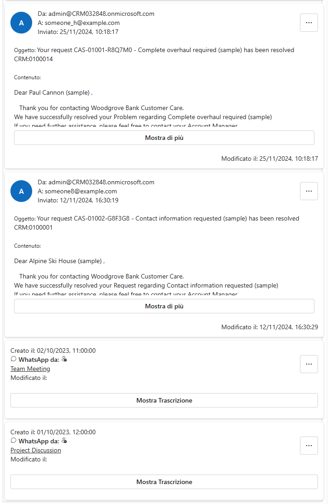

# Custom Timeline Control 📧


## Overview

Custom Timeline Control is a PowerApps Component Framework (PCF) control that provides a customized timeline view for emails and WhatsApp chats within a model-driven app.



You can try out the Custom Timeline Control on StackBlitz:

[](https://stackblitz.com/edit/github-whzswgsb?file=README.md)

## Features

- 📬 Customizable activities timeline view
- 📧 Collect emails and WhatsApp chats
- 📚 Multi-language support
- 📈 Support for debug mode
- 📱 Responsive design for any devices
- 🎨 Fluent UI components for a modern look
- 🛠️ Easy configuration settings
- 📅 Easy integration with model-driven apps
- 🔧 Configurable settings for display


## Installation

To install the Custom Email Timeline Control, follow these steps:

```powershell
git clone https://github.com/matteo-campana/CustomEmailTimelineControl.git
cd CustomEmailTimelineControl
npm install
npm run build -- --buildMode production
npm run start:watch
```

## Building and Deploying to Dataverse

To create and import a solution file:

```powershell
mkdir Solutions
cd Solutions
pac solution init --publisher-name developer --publisher-prefix dev
pac solution add-reference --path c:\downloads\mysamplecomponent
msbuild /t:restore
msbuild
# Or if you have installed the .NET SDK, version >= 6:
dotnet build
```

> Tip: If `msbuild 15.9.*` is not in the path, open Developer Command Prompt for VS 2017 to run the `msbuild` commands.

The generated solution files are located inside the `\bin\debug\` folder after the build is successful.

Manually import the solution into Dataverse using the web portal or automatically using the Microsoft Power Platform Build Tools.

### Connecting to your environment

```powershell
pac auth create --url <https://xyz.crm.dynamics.com>
pac auth list
pac auth select --index <index of the active profile>
```

### Selecting the target environment

```powershell
pac env list
pac env select --index <index of the target environment>
```

### Deploying code components

Ensure that you have a valid authentication profile created. Navigate to the directory where the sample component file is located and push the code components to the Dataverse instance:

```powershell
pac pcf push --publisher-prefix <your publisher prefix> --publisher-name <your publisher name>
```

> Note: The publisher prefix that you use with the push command should match the publisher prefix of your solution in which the components will be included.

## Input Parameters

The Custom Email Timeline Control accepts the following input parameters:

- `DebugMode`: A boolean option to enable or disable debug mode.
- `CollectCurrentRecord`: A boolean option to collect emails related to the current record.
- `CollectParent`: A boolean option to collect emails related to the parent record.
- `CollectAncestor`: A boolean option to collect emails related to ancestor records.
- `CollectEmails`: A boolean option to collect emails.
- `CollectWhatsAppChats`: A boolean option to collect WhatsApp chats.

## Scripts

The following scripts are available:

- `build`: Builds the project using `pcf-scripts build`.
- `clean`: Cleans the project using `pcf-scripts clean`.
- `lint`: Lints the project using `pcf-scripts lint`.
- `lint:fix`: Fixes linting issues using `pcf-scripts lint fix`.
- `rebuild`: Rebuilds the project using `pcf-scripts rebuild`.
- `start`: Starts the project using `pcf-scripts start`.
- `start:watch`: Starts the project in watch mode using `pcf-scripts start watch`.

## Dependencies

The project has the following dependencies:

- `react`: 16.14.0
- `@fluentui/react-components`: 9.46.2
- `react-dom`: 16.14.0

## Usage

To use the Custom Email Timeline Control in your model-driven app, follow these steps:

1. Import the solution into your environment.
2. Add the control to the desired form.
3. Configure the control settings as needed.

## Translations

The Custom Email Timeline Control supports multiple languages. The following translations are available:

- English (en-US)
- French (fr-FR)
- German (de-DE)
- Italian (it-IT)

To add a new translation, follow these steps:

1. Create a new `.resx` file in the `strings` directory with the appropriate language code.
2. Add the necessary translations to the `.resx` file.
3. Update the `ControlManifest.Input.xml` file to include the new `.resx` file.

Example:

```xml
<resx path="strings/CustomEmailTimelineControl.<language-code>.resx" version="1.0.2" />
```

## Contributing

Contributions are welcome! Please open an issue or submit a pull request for any changes.

## License

This project is licensed under the MIT License. See the [LICENSE](LICENSE) file for details.

## ⭐️ Show your support

Give a ⭐️ if this project helped you!

## 📬 Stay in touch

- Author: Matteo Campana
- GitHub: [matteo-campana](https://github.com/matteo-campana)
- LinkedIn: [matteo-campana](https://www.linkedin.com/in/matteo-campana)